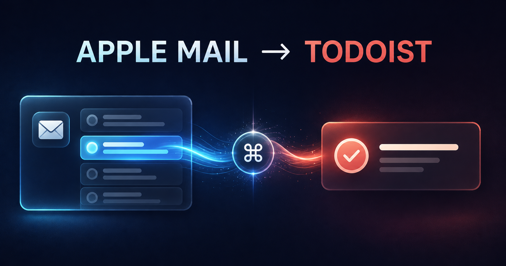

# Apple Mail to Todoist



[](LICENSE)
[](pyproject.toml)
[](.go/project.json)

Create one traceable Todoist task from the message selected in Apple Mail, confirm it with a lightweight Raycast HUD, and keep working without leaving Mail. The project is a narrow, local-first macOS integration with explicit privacy and retry guarantees.

## Project status

The main branch contains the verified executable workflow released as version `0.2.0`. It reads one selected Apple Mail message, creates an idempotent Todoist Inbox task through the official CLI, and returns immediate Raycast feedback followed by the final outcome notification.

## Product contract

The accepted interaction is deliberately small:

1. Select one message or one grouped conversation in Apple Mail on macOS.
2. Invoke **Create Todoist Task from Mail** in Raycast.
3. Create exactly one task through the official Todoist CLI.
4. Show an immediate Raycast HUD and a final macOS notification.
5. Leave the selected email unchanged.

The task defaults to Todoist Inbox, carries the `mail` label, has no inferred due date, and includes sender, received time, and a `message://` link back to the selected message. An optional command may expose project, date, priority, and title controls without slowing the default path.

## Purpose

Apple Mail and Todoist are excellent at different jobs, but turning correspondence into a commitment still creates friction. This project removes that friction while preserving three trust properties:

- **Mail stays read-only.** Task creation never archives, moves, flags, or deletes a message.
- **Authentication is delegated.** The official Todoist CLI performs browser OAuth and keeps its credential in macOS Keychain; this project never reads the token.
- **Retries stay safe.** Stable request identity and local reconciliation prevent uncertain network responses from producing duplicate tasks.

## Architecture at a glance

```text
Raycast command
    │
    ▼
local Python CLI ──read-only──▶ Apple Mail selection (JXA)
    │                              │
    │                              └── RFC Message-ID → message:// link
    ▼
task composer ──────────────▶ official Todoist CLI
    │
    ├── bounded task command ────▶ Todoist
    ├── minimal reconciliation ──▶ local app state
    └── outcome ─────────────────▶ Raycast HUD
```

See [Architecture](docs/architecture.md) for trust boundaries, data flow, failure states, and extension points.

## Installation

```bash
git clone https://github.com/viggomeesters/apple-mail-todoist.git
cd apple-mail-todoist
uv tool install --force --reinstall .
npm install -g @doist/todoist-cli
td auth login
```

`td auth login` opens Todoist in the browser once and stores the OAuth credential in macOS Keychain. The application invokes `td` but never reads or copies that credential. Verify setup with `td auth status`.

In Raycast, open **Settings → Extensions → Script Commands**, add this checkout's `scripts/raycast` directory, then optionally assign a hotkey to **Create Todoist Task from Mail**. The silent command returns immediately with `Creating Todoist task`; the bounded background capture reports its final result through macOS Notification Center.

## Usage

Select one message or one grouped conversation in Apple Mail, then invoke **Create Todoist Task from Mail** in Raycast. For a conversation, the newest message supplies the sender, date, and deep link while reply prefixes are removed from the task title. A true multiselect containing unrelated subjects remains rejected. You can exercise the same path in Terminal with:

```bash
apple-mail-todoist capture
```

Normal success prints `Todoist task created`. Repeating the command for the same message prints `Todoist task already exists` without a second API mutation. Selection, credential, definitive API, and uncertain-delivery failures use distinct bounded messages; an uncertain result deliberately blocks automatic replay until it has been reconciled.

## Development

Requirements:

- macOS for live Apple Mail and Todoist CLI credential-store integration work
- Node.js 24+, npm 11+, and the official Todoist CLI
- Python 3.11 or newer
- [`uv`](https://docs.astral.sh/uv/)
- Git

Validate a prepared clone:

```bash
make check
```

`make check` is the repository's authoritative local gate. It validates the Python package, tests, formatting/lint rules, machine-readable vision contract, `.go` workflow, documentation links, and public-data boundaries. This repository intentionally uses local gates instead of GitHub Actions.

## Repository map

| Path | Purpose |
|---|---|
| [`.go/`](.go/) | Canonical product vision, principles, hierarchy, tasks, and evidence |
| [`docs/vision.json`](docs/vision.json) | Machine-readable repository design and acceptance contract |
| [`docs/architecture.md`](docs/architecture.md) | Components, data flow, side effects, and failure model |
| [`docs/onboarding.md`](docs/onboarding.md) | Dependency-ordered orientation for developers and agents |
| [`docs/product-plan.md`](docs/product-plan.md) | Ordered implementation plan mirrored by open Go tasks |
| [`scripts/validate_repository.py`](scripts/validate_repository.py) | One-command local repository gate |
| [`schemas/`](schemas/) | Committed schemas for machine-readable contracts |
| [`src/apple_mail_todoist/`](src/apple_mail_todoist/) | Python package boundary; runtime modules arrive through Go tasks |

## Continue the work

The repo-local workflow is pinned to an immutable Go Workflow Stack release. Inspect the project and the first claimable task with:

```bash
./go status . --json
./go next .
```

Agents must read [`AGENTS.md`](AGENTS.md), [the design contract](docs/vision.json), and [the product plan](docs/product-plan.md) before claiming work. The normal continuation command is simply `Go`.

## Privacy and security

Never commit Todoist credentials, exported mail, message bodies, real addresses, live Message-IDs, reconciliation databases, logs, or credential-store exports. Tests use synthetic `example.invalid` identities. Report vulnerabilities through the private process in [`SECURITY.md`](SECURITY.md).

## Releases

Release history is recorded in [`CHANGELOG.md`](CHANGELOG.md). Version `0.2.0` is the first working-product release and is backed by the redacted evidence in [`docs/live-verification.md`](docs/live-verification.md).

## License

Copyright © 2026 Viggo Meesters. Released under the [MIT License](LICENSE).
