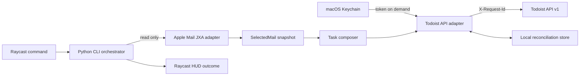

# Architecture

Apple Mail to Todoist is a local macOS command with one controlled external effect: create a Todoist task. Apple Mail is a read-only source. The architecture keeps Mail access, credentials, task composition, network delivery, reconciliation, and user feedback behind separate ports so the default test suite needs no private account or correspondence.

## System flow



## Component contracts

| Component | Reads | Writes | Boundary |
|---|---|---|---|
| Raycast script | Command exit and structured outcome | HUD only | Never receives the Todoist token or mail body |
| CLI orchestrator | One selected-mail snapshot | Adapter calls | Coordinates; contains no platform-specific query code |
| Apple Mail adapter | Current selection through JXA | Nothing | No archive, move, flag, delete, send, or mailbox mutation verbs |
| Task composer | Validated metadata | In-memory task request | Deterministic defaults; no inferred date, project, priority, or summary |
| Keychain adapter | One named generic-password item | Credential setup only through an explicit command | Token never appears in argv, config, logs, exceptions, or state |
| Todoist adapter | Task request and token | Todoist API v1 | Stable `X-Request-Id`, bounded timeout, typed responses |
| Reconciliation store | Hashed source identity and request identity | Minimal delivery status and Todoist task ID | No subject, sender, body, token, or raw API response |
| HUD renderer | Typed outcome | Raycast HUD | Success, existing-task, retry-safe failure, or reconciliation-needed message |

## Canonical data shapes

`SelectedMail` contains only the fields required to create the task:

```json
{
  "apple_mail_id": "synthetic-local-id",
  "rfc_message_id": "synthetic-123@example.invalid",
  "subject": "Synthetic project question",
  "sender_display": "Example Sender",
  "received_at": "2026-09-06T10:00:00Z"
}
```

The user-facing mail link is derived as `message://%3Csynthetic-123%40example.invalid%3E`. The raw RFC Message-ID is normalized once, angle brackets are added exactly once, and the URI payload is percent-encoded.

The Todoist request uses explicit fields rather than natural-language parsing:

```json
{
  "content": "Reply to: Synthetic project question",
  "description": "From: Example Sender\nReceived: 6 September 2026\n[Open in Apple Mail](message://%3Csynthetic-123%40example.invalid%3E)",
  "labels": ["mail"]
}
```

Omitting `project_id` places the task in Todoist Inbox. The default request contains no due date, deadline, priority override, mail body, or attachment.

## Idempotency and reconciliation

The source fingerprint is a SHA-256 digest of the normalized RFC Message-ID plus a versioned namespace. Each logical creation receives a stable request UUID stored before delivery and sent as `X-Request-Id`.

```text
new source → persist pending request → POST task → persist confirmed task ID
                                      └─ timeout/unknown → mark uncertain → reconcile before replay
known confirmed source → return existing task ID without POST
```

The local store lives under `~/Library/Application Support/apple-mail-todoist/` with user-only permissions. It stores hashes, request UUIDs, timestamps, delivery status, and Todoist task IDs. It never stores mail text or credentials.

## Failure model

- **No selection:** fail before Keychain or network access; show a concise selection hint.
- **Multiple selections:** fail closed in the default command; a separately designed bulk workflow may handle batches.
- **Missing RFC Message-ID:** fail without synthesizing an unstable deep link.
- **Missing credential:** show setup guidance without echoing secret material.
- **Definitive API rejection:** record no success and show a redacted reason code.
- **Timeout or malformed response:** mark delivery uncertain and require reconciliation before another POST.
- **HUD failure after confirmed creation:** retain confirmed state; a repeated invocation returns the existing task.

## Extension points

- A second Raycast command may collect project, due date, priority, or title before using the same core service.
- Task-title policy may become configurable without changing Mail or API ports.
- Body-derived or AI-assisted fields require a separate privacy decision and are excluded from the current product contract.
- A shared Apple Mail bridge should be extracted only when multiple independent consumers need the same stable adapter.

## Verification boundaries

Unit and contract tests use fake ports and synthetic identities. Live Mail, Keychain, link-opening, and Todoist checks are manual integration gates that require explicit scope and leave no tracked evidence containing private data.
